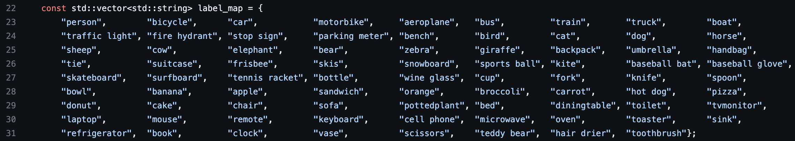
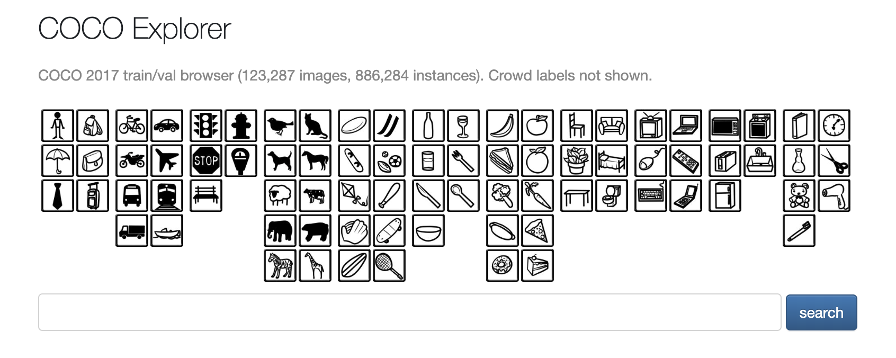
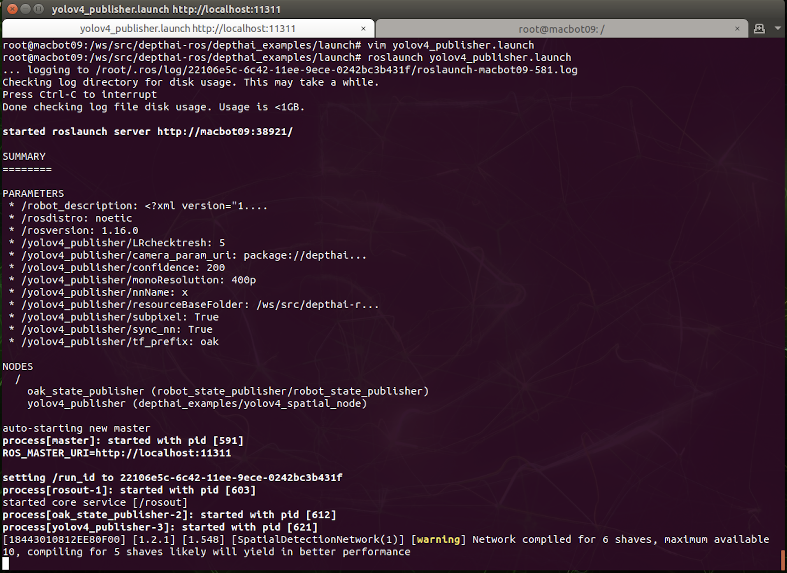
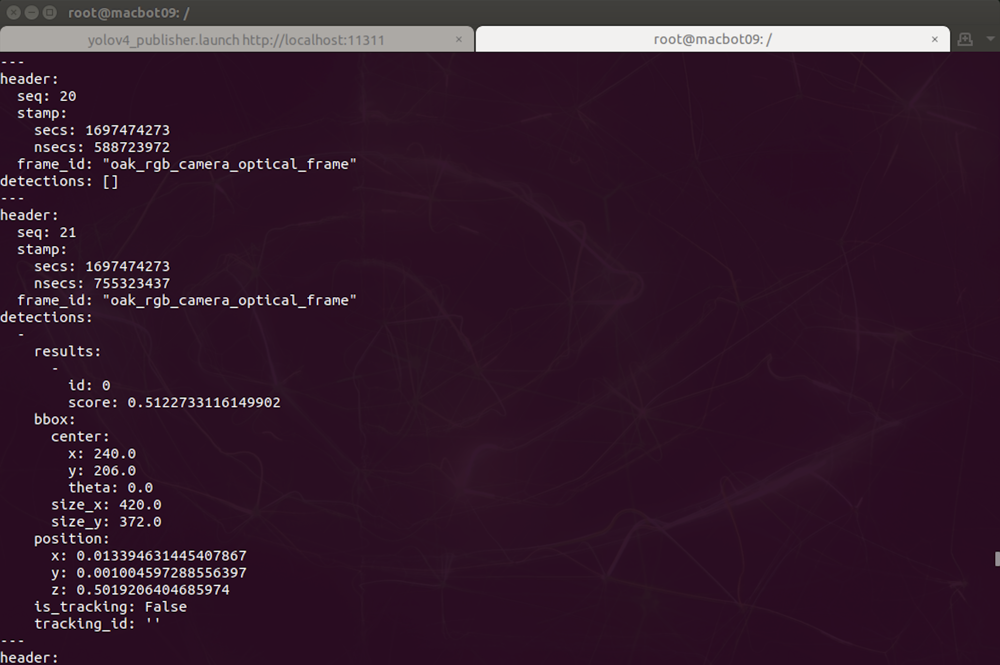
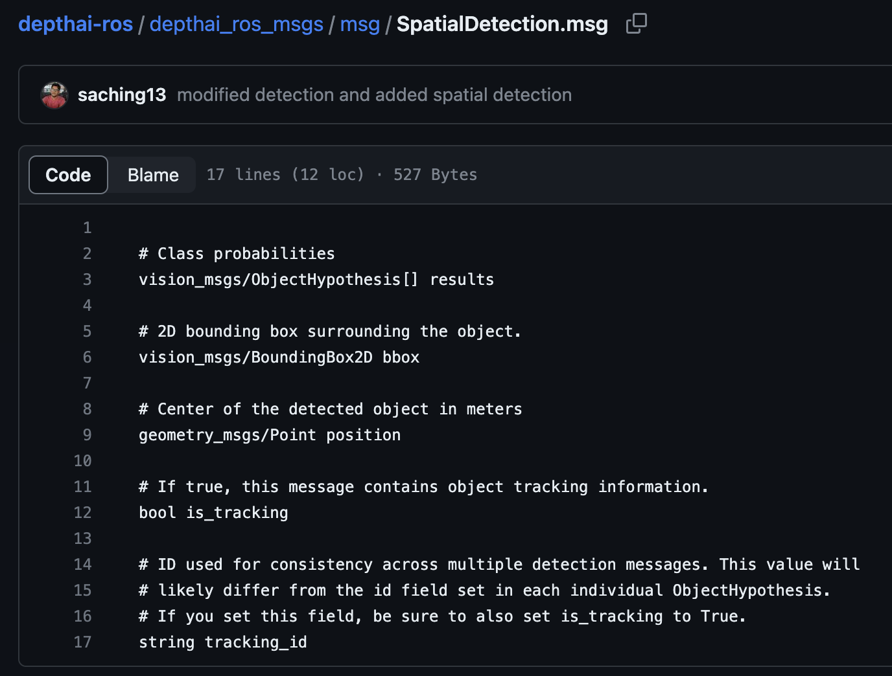

# 💾 Lab 4: 3D Object Detection and Depth Estimation with YOLO and Stereo Camera in ROS

## GitHub Repository



## Objectives


- To understand the integration of a stereo depth camera with ROS for 3D object detection.
- To learn to subscribe to and interpret the SpatialDetection ROS message that includes object hypotheses, bounding boxes, and 3D position data.
- To capture and analyze object detection data for specific COCO dataset classes, focusing on 'person' and another chosen class, within a real-world robotic context.
- To evaluate the accuracy of depth measurements provided by the stereo camera against known ground truth distances.
- To identify and discuss the potential sources of discrepancies between the detected and actual object positions, such as sensor limitations or environmental factors.

## Brief intro about YOLO 

YOLO (You Only Look Once) is a fast, accurate neural network-based object detection system that identifies and classifies objects in images in real-time. It is trained on the COCO dataset, which contains 80 diverse object categories ranging from people and vehicles to animals and everyday items. In practical setting, YOLO can be used to enable robots to detect objects within their field of vision and, when combined with depth data, ascertain the 3D position (XYZ coordinates) of each identified object. This capability is essential for a variety of robotic applications, including navigation, manipulation, and interaction with the environment.

### Cocodataset 80 classes:



In this ROS Lab, YOLO is integrated to perform object detection tasks within the OAK-D-Lite's environment. With additional processing, such as using depth sensing from the stereo camera, the system can estimate the x, y, and z coordinates of each detected object, effectively mapping them into the robot's 3D space.


### You can explore the cocodatset here:

https://cocodataset.org/#explore




## Lab Setup:

Follow the previous docker steps from Lab 3

Once you are inside the depthai-noetic docker image.

Run the following commands:

Navigate to the depthai_examples package

```bash
roscd depthai_examples
```

Look at the yolov4_publisher launch file and list the nodes inside

```bash
cat yolov4_publisher.launch

# or if vim exists in the docker

vim yolov4_publisher.launch
```

Run the launchfile

```bash
roslaunch yolov4_publisher.launch
```



It should look something like this 


### Now in a new terminal window (make sure you are inside the same docker image)

Run 
```bash
rostopic list
```

What does this output and what do they mean in general?

Look for `/yolov4_publisher/color/yolov4_Spatial_detections`

Now run:

```bash
rostopic echo /yolov4_publisher/color/yolov4_Spatial_detections
```

Now position yourself in front of the camer and you should see something like this:

depthai_rosmsgs.png



Important: The ID field conveys what the model detected at that frame. ID 0 means a person. there are 80 classes as mentioned above.


This is a SpatialDetection ROS message


- results: An array of ObjectHypothesis messages from vision_msgs, providing the class probabilities for detected objects, indicating how likely it is that a detected object belongs to a certain class.

- bbox: A BoundingBox2D message from vision_msgs, which describes a rectangle in the image that encloses the detected object.
position: A Point message from geometry_msgs that gives the central point of the detected object in 3D space, measured in meters.

- is_tracking: A boolean value that, if true, indicates that the message includes tracking information, allowing for the object to be followed over time.

- tracking_id: A string that serves as a unique identifier for tracking the object across multiple frames, enabling consistency in identification as the object moves.


Inside the bbox, there is a position field which attributes to `geometry_msgs/Point position` this is the object it has detected and gives the position to the Camera (Not the robot). 

### Which of the X, Y, Z gives us the depth information (Units are in meters per REP103 ros robotic standards)?


## Lab Procedure

### 1. Preparation
- Ensure the robot with the stereo depth camera is positioned in a stable location with a clear and unobstructed field of view.
- Make sure the testing area is adequate.

### 2. Launch and Record
```python
#!/usr/bin/env python
import rospy
from vision_msgs.msg import ObjectHypothesis
from geometry_msgs.msg import Point
from std_msgs.msg import Bool, String
from depthai_ros_msgs.msg import SpatialDetection

def callback(data):
    # Loop through each ObjectHypothesis in the results array
    for object_hypothesis in data.results:
        if object_hypothesis.id == 0:
            # If the id is 0, extract and print the position
            rospy.loginfo("Object with id=0 detected at position: x=%f, y=%f, z=%f", 
                          data.position.x, data.position.y, data.position.z)
            break  # Assuming you only want the first occurrence

def listener():
    rospy.init_node('yolo_subscriber', anonymous=True)
    rospy.Subscriber('/yolov4_publisher/color/yolov4_Spatial_detections', SpatialDetection, callback)
    rospy.spin()

if __name__ == '__main__':
    listener()
```


## Data Analysis:

- Tabulate the position data for detected objects, noting the changes in the detected distances over time.
- Compare this data with the ground truth measurements of object distances from the camera.
- Identify any discrepancies between the measured and actual distances.


## Discussion:

- Reflect on the performance of the stereo camera and YOLO detection system.
- Discuss potential sources of error, such as the minimum detectable distance of the camera, calibration issues, or environmental interference.
- Suggest improvements or considerations for real-world applications.

## Conclusion:
Summarize the findings and their implications for the use of stereo cameras and object detection in robotic applications.

