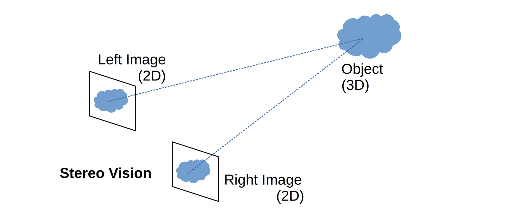
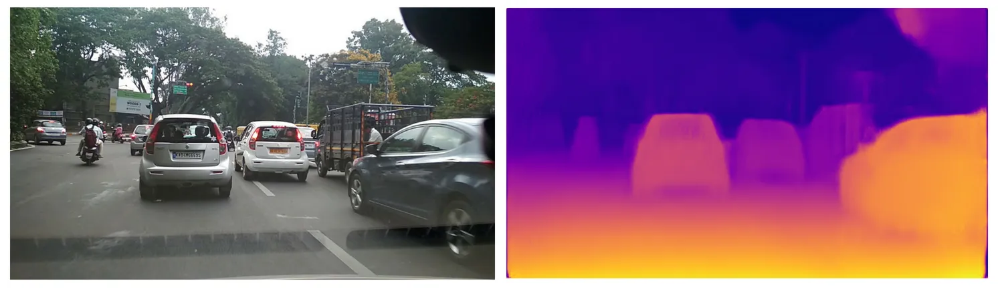
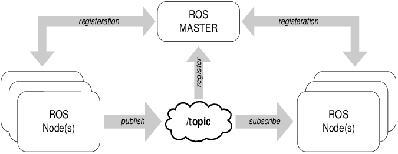
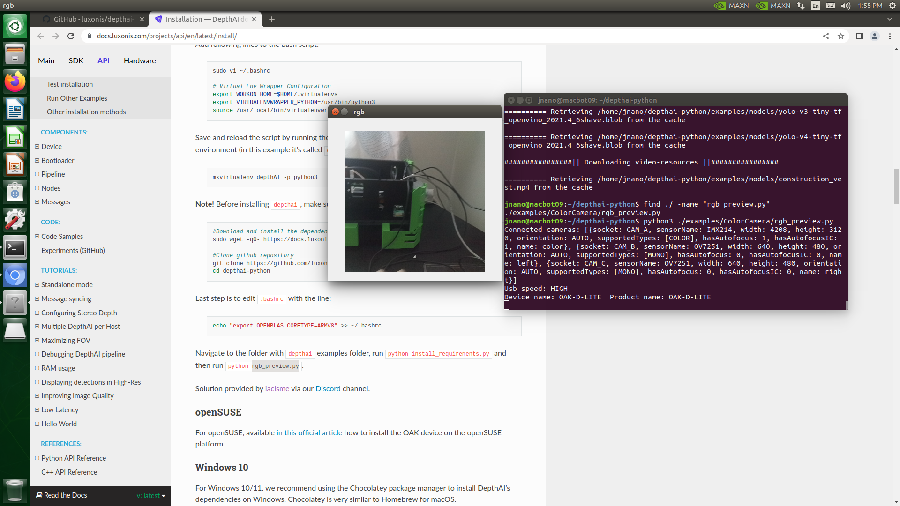
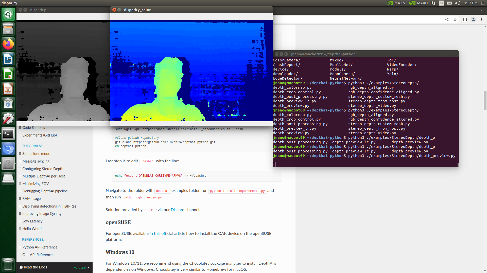
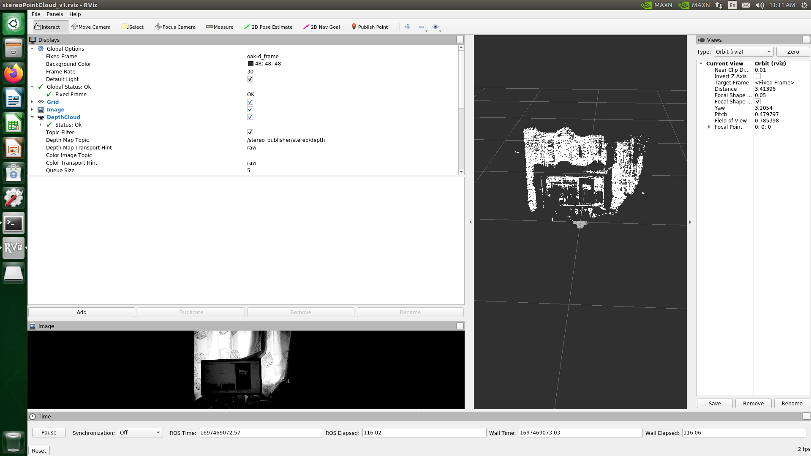
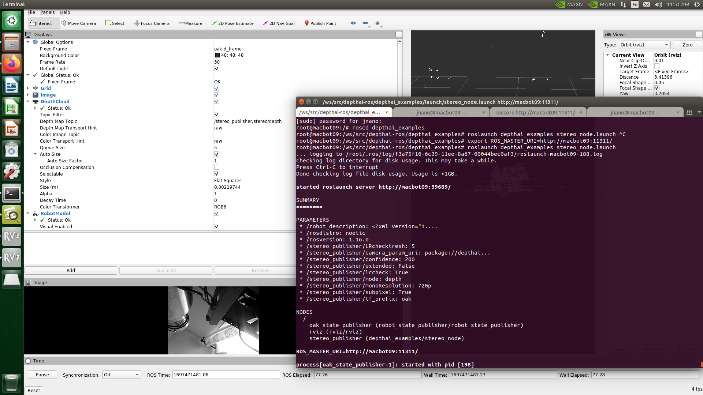
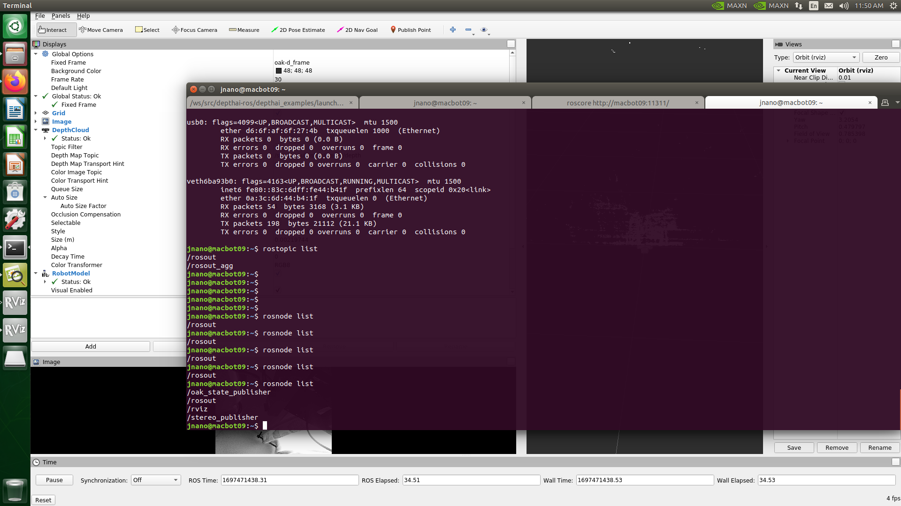


# 💾 Lab 7: Depth Camera Integration and Point Cloud Visualization

## GitHub Repository



## Objectives
Learn how to set up and use a depth camera with ROS to unlock the power of 3D perception in robotics and computer vision applications. With ROS (Robot Operating System) integration, you can seamlessly connect depth cameras to your robotic systems and leverage ROS functionalities to process and analyze depth data. Utilize ROS packages to generate a point cloud from depth images, enabling you to capture and interpret the spatial information of the environment in real-time. Visualize camera data in RViz, ROS's powerful visualization tool, to gain insights into the depth information captured by the camera and understand the scene's structure and geometry. By combining depth cameras with ROS, you can enhance your robotics projects with advanced perception capabilities and enable applications such as object detection, navigation, and manipulation in complex environments. Here are the steps that we follow in this Lab session:

-   Learn how to set up and use a depth camera with ROS.
    
-   Generate a point cloud from depth images.
        
-   Visualize camera data in RViz.


## Intro to Depth Cameras - OAK-D-LITE

In stereo vision, depth perception is achieved by capturing different views of an object in view from two or more cameras placed at separate locations, much like the human two eyes. The slight differences, or disparities, between these individual pixels are used to calculate the depth or distance of objects in view.

Depth Cameras uses two seperate cameras side by side, like human eyes. Each camera takes a picture. The system looks at a point on the object in both pictures and measures how far apart that point appears in the two images. Knowing this difference and how far apart the cameras are, the system can calculate how far away the object is.

**Baseline (B)**: The distance between the two cameras.

**Disparity (d)**: The difference in the position of the object in the two pictures.

**Focal Length (f)**: The distance inside each camera from the lens to the sensor, where the image is formed.
Simple Geometry:

Triangle Similarity: You can imagine two similar right triangles. One is formed by the focal length (f) and the object's position in one picture, and the other is formed by the baseline (B) and the actual distance to the object (Z). Ratio: The ratio of these triangles' sides gives you the equation:

    f / d = Z / B
​
Calculate Z (Distance to Object): With this equation, you can find the distance to the object (Z) by rearranging it:

    Z = (f * B) / d



## Depth Camera Application with Autonomous Vehicles

Depth cameras facilitate navigation for robots by generating a comprehensive 3D map of their surroundings. Additionally, they enhance object manipulation capabilities by providing precise depth data for accurate grasping and manipulation tasks. In medical robotics, depth cameras offer real-time 3D imaging to aid in complex surgical procedures. Moreover, these cameras are utilized in biomechanics for gait analysis, enabling the study of human movement and posture. In automotive applications, depth cameras play a pivotal role in Advanced Driver-Assistance Systems (ADAS) by detecting objects, pedestrians, and road signs. Furthermore, they are indispensable for autonomous vehicles, enabling real-time navigation and obstacle detection..

### Depth Maps and Collision Warning systems

A depth map, often represented as an image or image channel, provides valuable data about the distance between the surfaces of objects in a scene and a specific viewpoint. Estimating depth is essential for comprehending the geometric relationships within a scene, aiding in tasks such as collision avoidance and spatial awareness. In the context of calculating collision warnings, the initial step involved selecting a region of interest (ROI) from the disparity output. This ROI, highlighted in yellow to indicate the closest distance from the vehicle, was chosen as the focus area for collision assessment. Additionally, leveraging the YOLO object detection model enables the detection of various objects, pedestrians, and road signs. Such capabilities are integral for real-time navigation and obstacle detection, enhancing safety and efficiency in dynamic environments.



### From luxonis documenntation website: (https://www.luxonis.com/)
Stereo depth perception
The OAK-D Lite camera, developed by Luxonis, is a compact yet powerful depth sensing and AI camera designed for edge computing applications. Building upon Luxonis' expertise in depth perception and spatial AI, the OAK-D Lite camera offers advanced features such as stereo depth sensing, depth AI acceleration, and onboard processing capabilities in a small form factor. With its depth perception capabilities, the OAK-D Lite camera enables applications such as object detection, tracking, and 3D mapping, making it an ideal solution for robotics, augmented reality, and autonomous systems. This camera empowers developers to create innovative applications that require real-time depth sensing and AI inference at the edge, opening up new possibilities for intelligent and interactive systems. This OAK camera has a baseline of 7.5cm - the distance between the left and the right stereo camera. Minimal and maximal depth perception (MinZ and Max) depends on camera FOV, resolution, and baseline- more information here: https://docs.luxonis.com/projects/hardware/en/latest/pages/DM9095/

- Ideal range: 70cm - 8m
- MinZ: ~20cm (400P, extended), ~35cm (400P OR 800P, extended), ~70cm (800P)
- MaxZ: ~15 meters with a variance of 10% (depth accuracy evaluation)


## Quick review of ROS 
The integration of stereo cameras with ROS (Robot Operating System) holds significant importance in robotics and computer vision applications, as it enhances perception and spatial understanding for robotic systems. By incorporating stereo vision capabilities into ROS-enabled robots, developers gain access to depth information, allowing for more accurate and robust navigation, mapping, and object recognition tasks. Stereo cameras provide the ability to capture 3D information about the environment, enabling robots to accurately perceive depth and distance to objects. This information is crucial for tasks such as obstacle avoidance, path planning, and localization in dynamic and unstructured environments. Additionally, the integration of stereo cameras with ROS facilitates seamless communication and interoperability with other ROS-enabled components and libraries, empowering developers to build complex robotic systems with enhanced perception capabilities. Overall, the integration of stereo cameras with ROS enhances the autonomy, versatility, and reliability of robotic systems, enabling them to perform more effectively in a wide range of applications and scenarios. A brief review of the ROS

### Nodes

Nodes are essentially running programs that use ROS to communicate with each other. In a robot, you could have one node controlling the wheels, another processing sensor data, and another handling high-level logic. These nodes are modular and are designed to perform specific tasks.

### Topics

Topics are named buses over which nodes exchange messages. A node sends out a message by publishing it to a specific topic, and nodes that are interested in that type of message subscribe to that topic. The Publish-Subscribe pattern allows for asynchronous communication between nodes.

#### Publishers and Subscribers

-   **Publishers** are nodes that send out messages to a topic.
-   **Subscribers** are nodes that receive messages from a topic.




## Depth AI Python Jetson Nano Setup 
In this context, the phase described serves as an initial setup step aimed at configuring the Jetson system to work seamlessly with the OAK-D cameras. This involves ensuring that the necessary drivers and dependencies are installed to enable communication between the Jetson and the OAK-D cameras. Additionally, the installation of the DepthAI Python Library is performed during this phase. While this library is not directly related to ROS (Robot Operating System), it is essential for verifying the successful launch and operation of the OAK-D camera system after setup completion. Essentially, this phase ensures that the hardware and software components required for utilizing the OAK-D cameras are properly configured and operational before proceeding with further development or integration tasks within the ROS environment.
### 1. Define USB Rules:
Defining USB rules in Ubuntu is necessary for several reasons:Device Recognition, Permissions Management, Automated Actions, and Device Identification. USB rules allow Ubuntu to recognize and assign consistent names or paths to USB devices when they are connected to the system. This is particularly useful for devices such as serial ports, USB drives, or custom USB peripherals. To add a USB rule in Ubuntu, you typically use the 'udev' system, which manages device files in the /dev directory. 

Open a terminal window and run the following commands:

```bash
#Add USB rules to your system
echo 'SUBSYSTEM=="usb", ATTRS{idVendor}=="03e7", MODE="0666"' | sudo tee /etc/udev/rules.d/80-movidius.rules
sudo udevadm control --reload-rules && sudo udevadm trigger
```
`udevadm` is a command-line utility in Linux used for querying and controlling the udev device manager. udev is the device manager for the Linux kernel, responsible for managing device nodes and device events. It dynamically creates and removes device nodes in the /dev directory as devices are added or removed from the system (more info here:https://man.archlinux.org/man/udevadm.8.en)

keeping your system up-to-date : `sudo apt update` fetches the latest package information from repositories, and `sudo apt upgrade` installs the latest available versions of the installed packages, ensuring that your system has the most up-to-date software. Combining these commands with `&&` ensures that the upgrade command is only executed if update completes successfully, preventing upgrades based on outdated package lists.

```bash
sudo apt update && sudo apt upgrade
sudo reboot now
```
### 2. Resize SWAP
Swap space, also known as virtual memory, is an area on a storage device (such as a hard drive, SSD, or even a partition) that the operating system uses as an extension of physical RAM. When the system's physical RAM is fully utilized, the operating system moves data from RAM to the swap space to free up RAM for active proces. Swap space on a Jetson Nano (or any Linux-based system) is a reserved area on the storage device (typically a disk or an SD card) that the operating system uses as virtual memory when physical RAM (Random Access Memory) is full or insufficien.

Overall, resizing swap space on a Jetson Nano when using DepthAI can help ensure smooth operation of DepthAI applications and optimize system performance, particularly in scenarios where memory requirements are high or resource contention is a concern. Change the size of your SWAP. These instructions come from the `Getting Started with AI on Jetson <https://developer.nvidia.com/embedded/learn/jetson-ai-certification-programs>` from Nvidia:

 disbale the NVIDIA ZRAM swap configuration:
```bash
# Disable ZRAM:
sudo systemctl disable nvzramconfig
```
allocate 4G for SWAP:
```bash
# Create 4GB swap file
sudo fallocate -l 4G /mnt/4GB.swap
sudo chmod 600 /mnt/4GB.swap
sudo mkswap /mnt/4GB.swap
```
### 3. Install `pip` and `python3`
Python 3, the most recent major release of the Python programming language, finds widespread use across diverse domains including web development, data analysis, artificial intelligence, automation, and beyond. PIP, short for Python Package Index, serves as Python's package manager, streamlining the installation, management, and removal of Python packages sourced from the Python Package Index. While Python 3 constitutes the programming language, PIP functions as a utility enabling the smooth management of Python packages and their dependencies, thereby facilitating seamless integration with external libraries and enhancing Python's capabilities.

install the python3-pip package on a Debian-based Linux system, such as Ubuntu
```bash
sudo -H apt install -y python3-pip
```
The -H option sets the HOME environment variable to the home directory and -y option automatically answers "yes" to any prompts or questions.

### 3. Virtual environments for `pip` and `python3`
Virtual environments provide a sandboxed environment where you can install project-specific dependencies without affecting other Python projects or the system-wide Python installation. This isolation prevents conflicts between different versions of packages and ensures that each project has its own set of dependencies. How Virtual Environment Works

1.  **Isolation**: It isolates the Python interpreter, dependencies, libraries, and environment variables used within a specific project from the global interpreter.
    
2.  **Dependency Management**: It enables you to install Python libraries in the scope of the project rather than system-wide, thus avoiding version conflicts.
    
3.  **Switching Projects**: Virtual environments allow you to switch between different projects by activating or deactivating the corresponding environments, each with its own set of dependencies.

install and set up virtual environment (install two Python packages, virtualenv and virtualenvwrapper):

```bash
sudo -H pip3 install virtualenv virtualenvwrapper
```
The .bashrc file is a script file that contains commands and configurations for the Bash shell, which is the default shell for most Unix-like operating systems, including Linux. When you open a terminal session or start a new shell session, Bash reads and executes commands from the .bashrc file to set up the environment according to your preferences. In summary, the .bashrc file is a script file used to customize the behavior and environment of the Bash shell for individual users on Unix-like operating systems. adding virtual environment activation to the .bashrc file improves convenience, consistency, productivity, and adherence to best practices in Python development. It's a simple yet effective way to enhance your development workflow and ensure that you're always working within the appropriate environment for your projects.

open your `bashrc` file located in your home directory with vi (you can open/edit the bashrc in various way) 

```bash
sudo vi ~/.bashrc
```
add following lines to the bash script:
```bash
# Virtual Env Wrapper Configuration
export WORKON_HOME=$HOME/.virtualenvs
export VIRTUALENVWRAPPER_PYTHON=/usr/bin/python3
source /usr/local/bin/virtualenvwrapper.sh
```
Save and reload the script by running the command `source ~/.bashrc`.
```bash
source ~/.bashrc
```
then create a virtual environment (in this example it's called `depthAI`).
```bash
mkvirtualenv depthAI_ve -p python3
```
to check that you are in virtual envir0ment:
```bash
echo $VIRTUAL_ENV
```
it should return the following:


### 4. Installing Depth_AI
The DepthAI library from Luxonis is a software library designed to work with Luxonis DepthAI hardware modules. DepthAI is an embedded platform that integrates multiple capabilities for depth perception, object detection, and spatial AI tasks into a compact and low-power device. The platform is specifically designed for applications that require real-time processing of depth and visual data, such as robotics, augmented reality, autonomous vehicles, and more.


The DepthAI library provides a set of APIs and tools that enable developers to interact with DepthAI hardware and leverage its capabilities. Some of the key features and functionalities of the DepthAI library may include:

- Depth Sensing: The DepthAI hardware modules include stereo cameras and depth sensors, which allow for accurate depth perception and spatial mapping of the environment.

- Object Detection: The library may include pre-trained models and algorithms for detecting objects in the environment based on visual and depth data.

- Neural Inference: DepthAI hardware may be equipped with AI accelerators to perform real-time neural network inference for tasks such as object recognition, classification, and tracking.

- Spatial AI: The platform may support advanced spatial AI tasks, such as simultaneous localization and mapping (SLAM), gesture recognition, and scene understanding.

- Integration with Python: The DepthAI library may provide Python bindings and APIs, making it easy for developers to interact with DepthAI hardware and integrate it into their Python-based projects.

first download the updated Depth_AI dependencies from Luxonis:
```bash
#Download and install the dependency package
sudo wget -qO- https://docs.luxonis.com/install_dependencies.sh | bash
```
The command wget | bash is a combination of two commands chained together using the pipe (|) operator in a Unix-like shell environment.A dependency package in a shell script refers to an external software package or library that the script requires to function correctly. Ensuring that the necessary dependencies are installed on the system is crucial for the successful execution of the script.

then download the depthai-python from github repository:
```bash
#Clone github repository
git clone https://github.com/luxonis/depthai-python.git
```
In the context of OpenBLAS, which is an open-source implementation of the Basic Linear Algebra Subprograms (BLAS) library optimized for various CPU architectures, including ARM-based processors, setting the OPENBLAS_CORETYPE environment variable allows you to specify the target CPU architecture for optimization. By setting OPENBLAS_CORETYPE to ARMV8, you are instructing OpenBLAS to optimize its performance specifically for ARMv8-based CPUs (Jetson Nano is powered by an ARM Cortex-A57 CPU, which is an ARMv8-A architecture). 
Last step is to edit`.bashrc` with the line:
```bash
echo "export OPENBLAS_CORETYPE=ARMV8" >> ~/.bashrc
```
### 5. Depth_AI Examples 
Luxonis DepthAI offers a range of examples that demonstrate the capabilities of their hardware platform and software libraries. These examples cover various use cases and functionalities, allowing developers to quickly get started with DepthAI and explore its features. Here are some common examples provided by DepthAI Luxonis:

- Depth Sensing: Examples demonstrating depth sensing capabilities, including depth estimation, point cloud generation, and depth-based segmentation.

- Object Detection: Examples showcasing object detection using pre-trained models and DepthAI hardware for real-time detection of objects in the environment.

- Semantic Segmentation: Examples illustrating semantic segmentation, where objects in the scene are classified into different categories based on depth and visual data.

- Neural Inference: Examples demonstrating real-time neural network inference on DepthAI hardware, including custom model deployment and optimization.

- Spatial AI: Examples focusing on spatial AI tasks such as simultaneous localization and mapping (SLAM), 3D reconstruction, and scene understanding using DepthAI sensors and AI accelerators.

- Augmented Reality: Examples showing how DepthAI can be used for augmented reality applications, including virtual object placement, gesture recognition, and immersive experiences.

- Robotics: Examples demonstrating DepthAI's integration with robotics platforms for tasks such as navigation, obstacle avoidance, object tracking, and manipulation.

- Edge AI: Examples highlighting the use of DepthAI for edge AI applications, including edge computing, on-device processing, and low-latency inference.

- Custom Applications: DepthAI provides tools and resources for developing custom applications and solutions tailored to specific use cases and industries. Developers can leverage the examples and documentation to build innovative applications using DepthAI hardware and software.

more info are here https://docs.luxonis.com/projects/api/en/latest/tutorials/code_samples/. Navigate to the folder with `depthai` examples folder:
```bash
cd depthai-python/examples
```
there are various examples and available python codes:


#### 1. install_requirements.py 
The install_requirements.py script for DepthAI serves the purpose of installing the necessary dependencies and packages required to set up the DepthAI environment. This script automates the process of installing dependencies, making it easier for users to prepare their development environment for working with DepthAI hardware and software.

```bash
python3 install_requirements.py
```
here is the resualt:


#### 2. camera_isp.py  
The camera_isp.py script (located ~/depthai-python/examples/Camera) for the OAK-D camera, developed by Luxonis, likely provides functionalities specific to the Image Signal Processor (ISP) capabilities of the camera module. Here's a general overview of what the functionality of camera_isp.py for the OAK-D camera 
```bash
cd ~/depthai-python/examples/Camera
python3 camera_isp.py
```
You can see the 'left' and 'right' camera images (see the offset)


#### 3. depth_colormap.py 
The depth_colormap.py script from the DepthAI library is designed to provide users with tools and functionalities for visualizing, analyzing, and processing depth data captured by depth-sensing cameras, with a focus on generating colored depth maps for various applications in computer vision, robotics, and depth sensing:

```bash
cd ~/depthai-python/examples/StereoDepth
python3 depth_colormap.py 
```
You can see the colormap that demonstrate the distnace of the objects:


You can also try 'depth_preview.py' 
```bash
python3 depth_preview.py 
```
#### 4. spatial_calculator_multi_roi.py 
The spatial_calculator_multi_roi.py script likely serves as a tool within the DepthAI library for performing spatial calculations on depth data captured by depth-sensing cameras, such as those provided by the OAK-D camera module. The script  support multiple Regions of Interest (ROIs) within the depth data, allowing users to define multiple areas in the scene for spatial calculations. Each ROI could have its own set of parameters or configurations.script from the DepthAI library is designed to provide users with tools and functionalities for performing spatial calculations, analyzing depth data, and reconstructing 3D geometry from depth-sensing cameras, with support for multiple Regions of Interest (ROIs) and real-time visualization capabilities 
```bash
cd ~/depthai-python/examples/SpatialDetection
python3 spatial_calculator_multi_roi.py 
```
You can move around the objects and observe the distances:


run `python3 install_requirements.py` and then run `python3 rgb_preview.py` to test out if your camera works.
cd depthai-python




## Docker  + ROS

Each tagged version has it's own prebuilt docker image. To download and run it:

```bash
xhost +local:docker
```

to enable GUI tools such as rviz or rqt.

Then
```bash
docker run -it -v /dev/:/dev/  --privileged -e DISPLAY -v /tmp/.X11-unix:/tmp/.X11-unix luxonis/depthai-ros:noetic-latest bash
```

-   `docker run`: The command to create and start a new Docker container.
    
-   `-it`: Run the container in interactive mode with a terminal.
    
-   `-v /dev/:/dev/`: Mounts the `/dev/` directory of the host to `/dev/` inside the Docker container. This is usually done to provide the container with access to device files of the host system, which would include USB interfaces.
    
-   `--privileged`: Grants additional privileges to this container, allowing it to have almost the same level of access to the host machine as native processes running on the host. This is often used for accessing hardware devices like USB ports.
    
-   `-e DISPLAY`: Sets the `DISPLAY` environment variable in the container, allowing graphical applications to display on the host's X server.
    
-   `-v /tmp/.X11-unix:/tmp/.X11-unix`: This allows you to run graphical applications inside the container and have their windows displayed on the host's X server.
    
-   `luxonis/depthai-ros:noetic-latest`: Specifies the Docker image to use, which in this case is the latest version of `depthai-ros` built for ROS Noetic.

## Running Depth-AI ROS Noetic Docker Image

OAK-D Cameras by Luxonis utilize the official luxonis Depth-AI ROS packages which only include support for ROS 2 Distros
and only ROS Noetic Distro from ROS 1.

The ROS Distro you have been using the past labs is ROS Melodic which is compatiable with the On-Board Jestson Nano Linux system ubuntu 18.04. 

Unfortunetly ROS Noetic is not compatiable with Ubuntu 18.04 and thus can not be used. However we can use Docker Images to solve this problem !

### How Docker Helps

Docker allows you to create a containerized environment where you can run software independently of your host system. This means you can set up an Ubuntu 20.04 container with ROS Noetic installed, allowing you to use the Luxonis Depth-AI ROS packages without affecting your host system running Ubuntu 18.04.


```bash

xhost +local:docker
sudo docker run -it --network host -v /dev/:/dev/  --privileged -e DISPLAY -v /tmp/.X11-unix:/tmp/.X11-unix luxonis/depthai-ros:noetic-latest bash
```

once you are inside the docker container run the following 

```bash
roslaunch depthai_examples  stereo_node.launch
```



you can look inside the other depthai_* ROS Packages and attempt to run them. Please note some of them won't work. i.e. rtabmap launch files won't work as the package is not installed as part of the container. You can apt-get install it and other repos however, once containers are closed all the work inside of them are lost (unless you save current container into a new image).

Some of the launch files require a lot of memory for processing and can crash the jetson nano.
## How do we communicate between nodes in the docker container and with the master nodes in our host machine that run the robot from previous labs.

The ROS_MASTER_URI environment variable specifies the address where the ROS Master is running. In ROS, the Master is responsible for facilitating communication between different nodes. Nodes register themselves with the Master and inquire about other nodes they want to communicate with. Once two nodes know about each other through the Master, they can communicate directly.

### Setting ROS_MASTER_URI 

When you set `export ROS_MASTER_URI=http://macbot09:11311/` both inside the Docker container and on the host machine, you are telling ROS nodes in both environments to register with and look for other nodes at the Master running on http://macbot09:11311/. This allows nodes inside the container to communicate with nodes outside of the container, provided they are reachable over the network.

### --network host in Docker
The --network host option in Docker allows the container to share the host machine's network stack. This effectively gives the container full access to the same network interfaces as the host, meaning it can connect to the localhost of the host machine.

Here's how it all connects:

Host ROS Master: You run roscore on your host machine. This starts the ROS Master at a specific URI, say http://macbot09:11311/.

Docker Container: You start a Docker container with the --network host option. This means any network activity in the container is as if it is coming from the host machine itself.

Setting ROS_MASTER_URI: Inside the Docker container, you set ROS_MASTER_URI to http://macbot09:11311/, the same as the host machine.


Now exit the container by entering `exit` into the terminal

in a new tab run `roscore`. This will start up a ROS Master 


Now  re run these commands

```bash

xhost +local:docker
sudo docker run -it --network host -v /dev/:/dev/  --privileged -e DISPLAY -v /tmp/.X11-unix:/tmp/.X11-unix luxonis/depthai-ros:noetic-latest bash
```

once you are inside the docker container run the following 

```bash
roslaunch depthai_examples  stereo_node.launch
```




Create a new tab (original host terminal should be opened)

run 
```bash
rosnode list

rostopic list
```



The ros master on your host machine (Jetson nano) should be able to see and read the depthai-ros-neotic nodes from the docker container. Paste a screenshot in your report

## Listing Docker containers
```
sudo docker images
```


## Lab Questions:

Derive the formula Z = (f * B) / d. Explain each variable in the equation.

What are the limitations of the OAK-D-LITE camera in terms of minimum and maximum depth perception (MinZ and MaxZ)?

Explain how Docker aids in running software independently of the host system. How does it solve the compatibility issue with ROS versions?


What does roslaunch do in the ROS ecosystem? Describe its primary function and provide an example command.


What is a ROS launch file and why is it important?

Provide an example of a launch file from the OAK-D-LITE package used in this lab. Break down its components and explain each part.


## Lab Requiremnts:

Include a screenshot of the depth camera nodes in RVIZ in your report.
