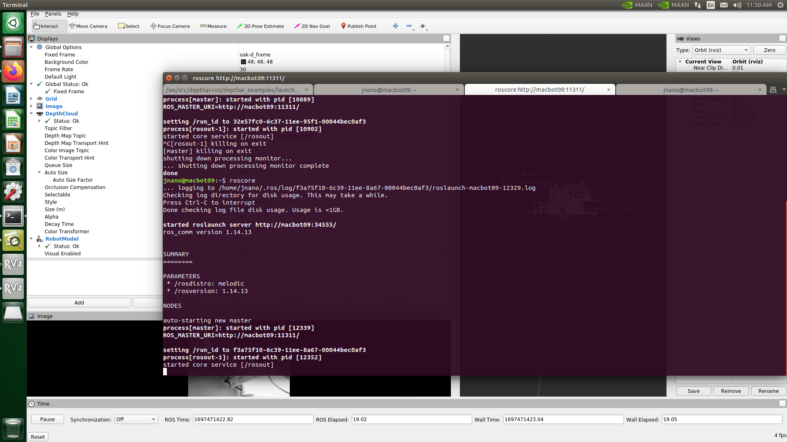

# 💾 Lab 7: Depth Camera Integration and Point Cloud Visualization

## GitHub Repository



## Objectives


-   Learn how to set up and use a depth camera with ROS.
    
-   Generate a point cloud from depth images.
        
-   Visualize camera data in RViz.


## Intro to Depth Cameras - OAK-D-LITE

In stereo vision, depth perception is achieved by capturing different views of an object in view from two or more cameras placed at separate locations, much like the human two eyes. The slight differences, or disparities, between these individual pixels are used to calculate the depth or distance of objects in view.

Depth Cameras uses two seperate cameras side by side, like human eyes. Each camera takes a picture. The system looks at a point on the object in both pictures and measures how far apart that point appears in the two images. Knowing this difference and how far apart the cameras are, the system can calculate how far away the object is.


Baseline (B): The distance between the two cameras.

Disparity (d): The difference in the position of the object in the two pictures.

Focal Length (f): The distance inside each camera from the lens to the sensor, where the image is formed.
Simple Geometry:

Triangle Similarity: You can imagine two similar right triangles. One is formed by the focal length (f) and the object's position in one picture, and the other is formed by the baseline (B) and the actual distance to the object (Z).

Ratio: The ratio of these triangles' sides gives you the equation:

    f / d = Z / B

​
 
Calculate Z (Distance to Object): With this equation, you can find the distance to the object (Z) by rearranging it:

    Z = (f * B) / d


### From luxonis documenntation website:
Stereo depth perception
This OAK camera has a baseline of 7.5cm - the distance between the left and the right stereo camera. Minimal and maximal depth perception (MinZ and Max) depends on camera FOV, resolution, and baseline- more information here.

Ideal range: 70cm - 8m

MinZ: ~20cm (400P, extended), ~35cm (400P OR 800P, extended), ~70cm (800P)

MaxZ: ~15 meters with a variance of 10% (depth accuracy evaluation)


## Depth Camera Application with Autonomous Vehicles

Navigation: Depth cameras help robots to navigate by creating a 3D map of their environment.
Object Manipulation: Depth data can aid in the precise grasping and manipulation of objects.

Surgical Assistance: In medical robotics, depth cameras can provide real-time 3D imaging to assist in complex surgeries.
Gait Analysis: Used in biomechanics to study human movement and posture.

Advanced Driver-Assistance Systems (ADAS): Depth cameras can be used to detect objects, pedestrians, and even road signs.
Autonomous Vehicles: Crucial for real-time navigation and obstacle detection.


### Depth Maps and Collision Warning systems

A depth map is an image or image channel that contains information relating to the distance of the surfaces of scene objects from a viewpoint. Estimating depth is an important component of understanding geometric relations within a scene.

The first step to calculating the collision warning was to select a region of interest (ROI) from the disparity output. The yellow region which signifies least distance from the vehicle was taken as the ROI

You can also use YOLO object detection model to detect objects, pedestrians, and even road signs.

This can be crucial for real-time navigation and obstacle detection.


## Quick review of ROS 

### Nodes

Nodes are essentially running programs that use ROS to communicate with each other. In a robot, you could have one node controlling the wheels, another processing sensor data, and another handling high-level logic. These nodes are modular and are designed to perform specific tasks.

### Topics

Topics are named buses over which nodes exchange messages. A node sends out a message by publishing it to a specific topic, and nodes that are interested in that type of message subscribe to that topic. The Publish-Subscribe pattern allows for asynchronous communication between nodes.

#### Publishers and Subscribers

-   **Publishers** are nodes that send out messages to a topic.
-   **Subscribers** are nodes that receive messages from a topic.


## Depth AI Python Jetson Nano Setup 
##### This phase serves as a preliminary step, focusing on the configuration of your Jetson system to interface with the OAK-D cameras effectively. It also involves the installation of the DepthAI Python Library,  which is not related to ROS but is to verify the successful launch and functioning of the OAK-D camera system post-setup.

Open a terminal window and run the following commands:
```bash
#Add USB rules to your system

echo 'SUBSYSTEM=="usb", ATTRS{idVendor}=="03e7", MODE="0666"' | sudo tee /etc/udev/rules.d/80-movidius.rules
sudo udevadm control --reload-rules && sudo udevadm trigger
```

```bash
sudo apt update && sudo apt upgrade
sudo reboot now
```
Change the size of your SWAP. These instructions come from the `Getting Started with AI on Jetson <https://developer.nvidia.com/embedded/learn/jetson-ai-certification-programs>` from Nvidia:

```bash
# Disable ZRAM:
sudo systemctl disable nvzramconfig
# Create 4GB swap file
sudo fallocate -l 4G /mnt/4GB.swap
sudo chmod 600 /mnt/4GB.swap
sudo mkswap /mnt/4GB.swap
```
install `pip` and `python3` 

```bash
sudo -H apt install -y python3-pip
```
After that, install and set up virtual environment:
```bash
sudo -H pip3 install virtualenv virtualenvwrapper
```
#### How Virtual Environment Works

1.  **Isolation**: It isolates the Python interpreter, dependencies, libraries, and environment variables used within a specific project from the global interpreter.
    
2.  **Dependency Management**: It enables you to install Python libraries in the scope of the project rather than system-wide, thus avoiding version conflicts.
    
3.  **Switching Projects**: Virtual environments allow you to switch between different projects by activating or deactivating the corresponding environments, each with its own set of dependencies.

Add following lines to the bash script:

```bash
sudo vi ~/.bashrc

# Virtual Env Wrapper Configuration
export WORKON_HOME=$HOME/.virtualenvs
export VIRTUALENVWRAPPER_PYTHON=/usr/bin/python3
source /usr/local/bin/virtualenvwrapper.sh
```
Save and reload the script by running the command `source ~/.bashrc`. Then create a virtual environment (in this example it's called `depthAI`).
  
```bash
mkvirtualenv depthAI_ve -p python3
```
**Note!** Before installing `depthai`, make sure you're in the virtual environment.

```bash

#Download and install the dependency package
sudo wget -qO- https://docs.luxonis.com/install_dependencies.sh | bash

#Clone github repository
git clone https://github.com/luxonis/depthai-python.git
cd depthai-python
```
Last step is to edit :code:`.bashrc` with the line:

```bash
echo "export OPENBLAS_CORETYPE=ARMV8" >> ~/.bashrc
```
Navigate to the folder with `depthai` examples folder, run `python3 install_requirements.py` and then run `python3 rgb_preview.py` to test out if your camera works.


## Docker  + ROS

Each tagged version has it's own prebuilt docker image. To download and run it:

```bash
xhost +local:docker
```

to enable GUI tools such as rviz or rqt.

Then
```bash
docker run -it -v /dev/:/dev/  --privileged -e DISPLAY -v /tmp/.X11-unix:/tmp/.X11-unix luxonis/depthai-ros:noetic-latest bash
```

-   `docker run`: The command to create and start a new Docker container.
    
-   `-it`: Run the container in interactive mode with a terminal.
    
-   `-v /dev/:/dev/`: Mounts the `/dev/` directory of the host to `/dev/` inside the Docker container. This is usually done to provide the container with access to device files of the host system, which would include USB interfaces.
    
-   `--privileged`: Grants additional privileges to this container, allowing it to have almost the same level of access to the host machine as native processes running on the host. This is often used for accessing hardware devices like USB ports.
    
-   `-e DISPLAY`: Sets the `DISPLAY` environment variable in the container, allowing graphical applications to display on the host's X server.
    
-   `-v /tmp/.X11-unix:/tmp/.X11-unix`: This allows you to run graphical applications inside the container and have their windows displayed on the host's X server.
    
-   `luxonis/depthai-ros:noetic-latest`: Specifies the Docker image to use, which in this case is the latest version of `depthai-ros` built for ROS Noetic.

## Running Depth-AI ROS Noetic Docker Image

OAK-D Cameras by Luxonis utilize the official luxonis Depth-AI ROS packages which only include support for ROS 2 Distros
and only ROS Noetic Distro from ROS 1.

The ROS Distro you have been using the past labs is ROS Melodic which is compatiable with the On-Board Jestson Nano Linux system ubuntu 18.04. 

Unfortunetly ROS Noetic is not compatiable with Ubuntu 18.04 and thus can not be used. However we can use Docker Images to solve this problem !

### How Docker Helps

Docker allows you to create a containerized environment where you can run software independently of your host system. This means you can set up an Ubuntu 20.04 container with ROS Noetic installed, allowing you to use the Luxonis Depth-AI ROS packages without affecting your host system running Ubuntu 18.04.


```bash

xhost +local:docker
sudo docker run -it --network host -v /dev/:/dev/  --privileged -e DISPLAY -v /tmp/.X11-unix:/tmp/.X11-unix luxonis/depthai-ros:noetic-latest bash
```

once you are inside the docker container run the following 

```bash
roslaunch depthai_examples  stereo_node.launch
```


you can look inside the other depthai_* ROS Packages and attempt to run them. Please note some of them won't work. i.e. rtabmap launch files won't work as the package is not installed as part of the container. You can apt-get install it and other repos however, once containers are closed all the work inside of them are lost (unless you save current container into a new image).

Some of the launch files require a lot of memory for processing and can crash the jetson nano.
## How do we communicate between nodes in the docker container and with the master nodes in our host machine that run the robot from previous labs.

The ROS_MASTER_URI environment variable specifies the address where the ROS Master is running. In ROS, the Master is responsible for facilitating communication between different nodes. Nodes register themselves with the Master and inquire about other nodes they want to communicate with. Once two nodes know about each other through the Master, they can communicate directly.

### Setting ROS_MASTER_URI 

When you set `export ROS_MASTER_URI=http://macbot09:11311/` both inside the Docker container and on the host machine, you are telling ROS nodes in both environments to register with and look for other nodes at the Master running on http://macbot09:11311/. This allows nodes inside the container to communicate with nodes outside of the container, provided they are reachable over the network.

### --network host in Docker
The --network host option in Docker allows the container to share the host machine's network stack. This effectively gives the container full access to the same network interfaces as the host, meaning it can connect to the localhost of the host machine.

Here's how it all connects:

Host ROS Master: You run roscore on your host machine. This starts the ROS Master at a specific URI, say http://macbot09:11311/.

Docker Container: You start a Docker container with the --network host option. This means any network activity in the container is as if it is coming from the host machine itself.

Setting ROS_MASTER_URI: Inside the Docker container, you set ROS_MASTER_URI to http://macbot09:11311/, the same as the host machine.


Now exit the container by entering `exit` into the terminal

in a new tab run `roscore`. This will start up a ROS Master 




Now  re run these commands

```bash

xhost +local:docker
sudo docker run -it --network host -v /dev/:/dev/  --privileged -e DISPLAY -v /tmp/.X11-unix:/tmp/.X11-unix luxonis/depthai-ros:noetic-latest bash
```

once you are inside the docker container run the following 

```bash
roslaunch depthai_examples  stereo_node.launch
```


Create a new tab (original host terminal should be opened)

run 
```bash
rosnode list

rostopic list
```


The ros master on your host machine (Jetson nano) should be able to see and read the depthai-ros-neotic nodes from the docker container. Paste a screenshot in your report

## Listing Docker containers
```
sudo docker images
```


## Lab Questions:

Derive the formula Z = (f * B) / d. Explain each variable in the equation.

What are the limitations of the OAK-D-LITE camera in terms of minimum and maximum depth perception (MinZ and MaxZ)?

Explain how Docker aids in running software independently of the host system. How does it solve the compatibility issue with ROS versions?


What does roslaunch do in the ROS ecosystem? Describe its primary function and provide an example command.


What is a ROS launch file and why is it important?

Provide an example of a launch file from the OAK-D-LITE package used in this lab. Break down its components and explain each part.


## Lab Requiremnts:

Include a screenshot of the depth camera nodes in RVIZ in your report.
